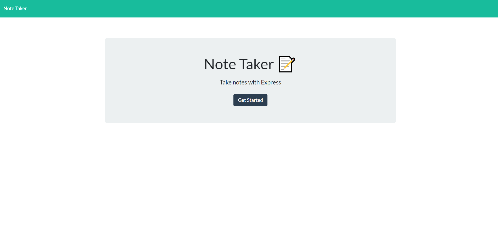
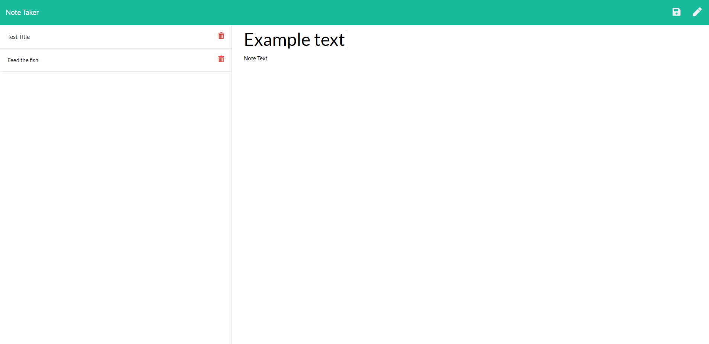

# NoteTaker

## Table of Contents

1. [Description](#Description)
2. [Criteria](#Criteria)
3. [Installation](#Installation)
4. [Usage](#Usage)
5. [Contributing](#Contributing)
6. [Issues](#Issues)
7. [License](#License)
8. [Questions](#Questions)

## Description

We were given code for the front-end operations of this application and expected to create and connect it to the back-end. So we had to create a server, initialize it, and program the framework that allowed information to be added to and removed from a database file contained within the db folder.

The application itself is a note website where the user can enter a note as a sort of reminder for later, like a sticky-note. The note can be written and saved and pulled back up again later. The notes can also be deleted.

I had some trouble with writing to the db.json at first, but after researching a few examples, I was able to use require to set it to a variable that allowed it to be edited much easier. Other than that, I didn't have too much difficulty with this assignment.

Unable to be deployed to GitHub.

[Link to website on Heroku](https://tranquil-note-taker.herokuapp.com/)

Example pictures:

## Criteria

GIVEN a note-taking application

WHEN I open the Note Taker

THEN I am presented with a landing page with a link to a notes page

    * Used app.get to create a default route that loads index.html

WHEN I click on the link to the notes page

THEN I am presented with a page with existing notes listed in the left-hand column, plus empty fields to enter a new note title and the note’s text in the right-hand column

    * Used app.get to create a route to the /notes page that loads notes.html

WHEN I enter a new note title and the note’s text

THEN a Save icon appears in the navigation at the top of the page

    * This was included in the front-end code that was given to us

WHEN I click on the Save icon

THEN the new note I have entered is saved and appears in the left-hand column with the other existing notes

    * Used app.post, fs.writeFile, and .push method

    * Takes the request, adds it to the db.json array, and rewrites the db.json file to include the new object

WHEN I click on an existing note in the list in the left-hand column

THEN that note appears in the right-hand column

    * Used a for-loop and if statement to give the new object an ID

    * The rest of the necessary code was written into the front-end

WHEN I click on the Write icon in the navigation at the top of the page

THEN I am presented with empty fields to enter a new note title and the note’s text in the right-hand column

    * Mostly written into the front-end, although I noticed it stayed read-only if an old note was viewed

    * Changed the front-end so readonly: true was removed when the pencil is clicked

## Installation

No installation needed.

## Usage

Click Get Started to move to Notes page. There, the user can click Note Title and Note Text to write a note, then click the save icon at the top right to save it. To see a note's text, click the note's title on the left and it will show on the right as read only. Click the pencil at the top right to write a new note. To delete a note, click the trashcan next to the note title on the list on the left.

## Contributing

For contributions, please create a fork to work on then, when done, create a Pull Request.

## Issues

Submit an Issue through Github for any bugs or problems.

## License

Copyright Ashley Wright 2021

This is covered under the <a href='https://opensource.org/licenses/ISC'>ISC</a> license.

## Questions

Feel free to contact through the following with any questions:

Email: ashleyaggie@aol.com

Github: <a href='https://github.com/ashleyaggie'>ashleyaggie</a>